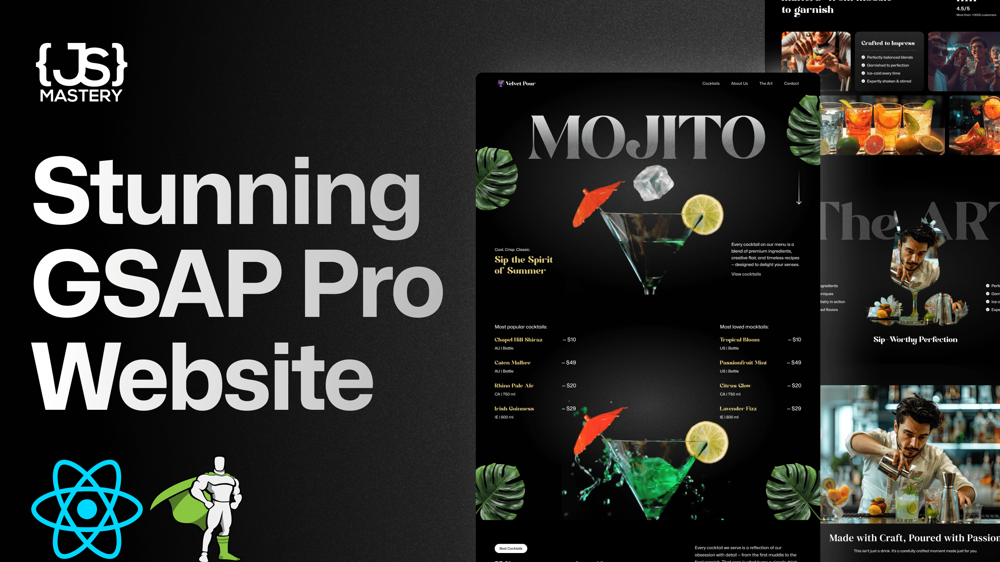

# Velvet Pour - GSAP & React Cocktail Landing Page



This repository contains a modern, highly interactive landing page for a fictional cocktail bar, "Velvet Pour". The project showcases complex scroll-based animations, text splitting, video scrubbing, and image masking, creating a premium and engaging user experience.

> **Note:** This project was built by following a tutorial from the YouTube channel **[JavaScript Mastery](https://www.youtube.com/@javascriptmastery)**.

## 🚀 Technologies Used

- **React 19:** Component-based UI library.
- **Vite:** Next-generation frontend tooling for fast builds.
- **Tailwind CSS v4:** Utility-first CSS framework for rapid styling.
- **GSAP (GreenSock Animation Platform):** Industry-standard animation library used for sophisticated scrolling and sequencing.
  - `ScrollTrigger`: For triggering animations based on scroll position (including pinning, scrubbing).
  - `SplitText`: For splitting text into characters, words, and lines for intricate typographic animations.
  - `@gsap/react`: GSAP's official hook for managing animation contexts and lifecycles in React.
- **react-responsive:** Media queries in React for dynamic responsiveness.

## ✨ Key Features & Components

- **Hero Section (`Hero.jsx`):** 
  - Text enters with a cascading `SplitText` animation.
  - Features a background video where the playback `currentTime` is scrubbed back and forth according to the user's scroll position, creating a stunning visual effect.
- **Cocktails List (`Cocktails.jsx`):** 
  - Displays the most popular cocktails and mocktails.
  - Uses ScrollTrigger to animate parallax "floating leaf" images that react dynamically to scrolling.
- **About Section (`About.jsx`):** 
  - An asymmetric image grid that reveals itself smoothly via staggered animations as you scroll down the page.
- **The Art Section (`Art.jsx`):** 
  - A pinned section (`pin: true` in ScrollTrigger) with an expanding image mask effect that scales a masked container while fading out foreground elements.
- **Menu Slider (`Menu.jsx`):** 
  - An interactive cocktail slider showcasing drink details. Every time the slide changes, the image and recipe details transition using custom `gsap.fromTo` timelines.
- **Navbar & Contact (`Navbar.jsx`, `Contact.jsx`):** 
  - The Navbar features a scroll-triggered `backdrop-filter` blur effect.
  - The Contact section (footer) concludes the page with organized location information, hours, and another smooth animated entrance.

## 📂 Project Structure

```text
├── components/          # React components
│   ├── About.jsx
│   ├── Art.jsx
│   ├── Cocktails.jsx
│   ├── Contact.jsx
│   ├── Hero.jsx
│   ├── Menu.jsx
│   └── Navbar.jsx
├── constants/           # Static data (menus, social links, hours)
│   └── index.js
├── src/
│   ├── App.jsx          # Main component tying all sections together
│   ├── App.css          # Global CSS and custom fonts
│   └── main.jsx         # React application entry point
├── public/              # Static assets (images, videos)
└── package.json         # Dependencies and scripts
```

## 🛠️ Getting Started

### Prerequisites
Make sure you have Node.js installed on your machine.

### Installation

1. Clone the repository (if applicable)
2. Install the dependencies:
   ```bash
   npm install
   ```
3. Run the development server:
   ```bash
   npm run dev
   ```
4. Open your browser and navigate to the provided local URL (typically `http://localhost:5173`).

## 📜 License

This project is intended for educational purposes as part of the JavaScript Mastery tutorial series.
